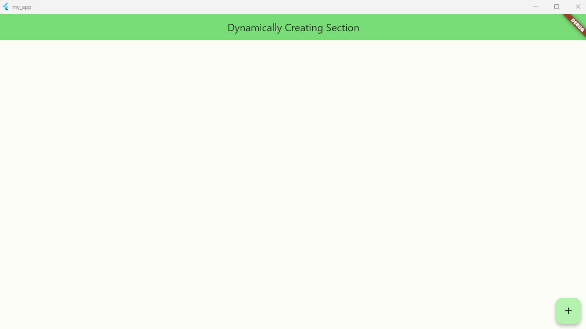
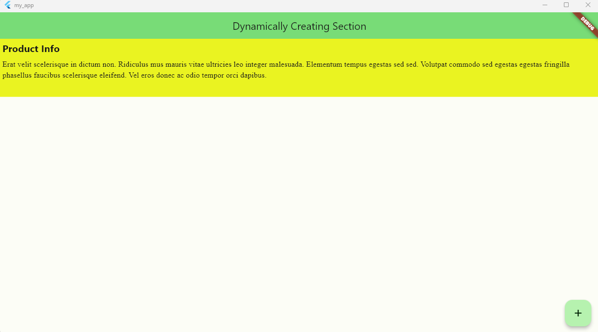

# Flutter-Dynamic-Section-HomePage

MyApp is a Flutter project that demonstrates dynamically creating sections with different styles and content.

## Getting Started

To run the app, follow these steps:

1. Make sure you have Flutter installed on your machine.

2. Clone this repository.

3. Open the project in your preferred IDE or editor.

4. Run the app using the Flutter run command.

## Description

MyApp is a simple Flutter application that allows users to dynamically create sections with custom names, colors, heights, font sizes, and font families. Each section consists of a title and a description. The user can choose a color from a color picker, select the section height and font size using sliders, and choose a font family from a dropdown list.

## Features

- Dynamically create sections with custom names, colors, heights, font sizes, and font families.
- Choose colors using a color picker.
- Adjust section height and font size using sliders.
- Select font family from a list of available options.

## Dependencies

The following dependencies are used in this project:

- `faker`: A library for generating fake data.
- `flutter_colorpicker`: A color picker widget for Flutter.

## Detail Description of Code

The code begins with importing the required dependencies and packages, including Flutter material library, Dart:convert, faker (for generating random data), flutter_colorpicker for color selection, and dart:ui for accessing device information.

Next, the main() function is defined, which is the entry point of the Flutter application. It calls the runApp() function to start the app by passing an instance of the MyApp class.

The MyApp class is a stateless widget that represents the root of the application. It defines the app's title, theme, and the home screen, which is an instance of the MyHomePage class.

The MyHomePage class is a stateful widget that represents the home screen of the application. It contains the main logic and UI for dynamically creating sections. It has an initial state represented by the \_MyHomePageState class.

Inside the \_MyHomePageState class, the code initializes the required variables and controllers in the initState() method. It sets up the initial layout data as an empty list and initializes the scroll controller and section name text controller.

The code defines several helper methods:

- \_scrollToSectionEnd(): This method scrolls to the end of the list of sections by setting the scroll controller's offset to the maximum scroll extent.

- \_showColorPicker(BuildContext context): This method shows a color picker dialog using the flutter_colorpicker package. It allows the user to select a color and updates the selected color when changed.

- \_addNewSection(): This method is called when the user wants to add a new section. It validates the section name and selected properties such as color, height, font size, and font family. If the validation is successful, it generates a random paragraph using the faker package and adds a new section with the provided properties to the layoutData list. It also clears the section name text controller and scrolls to the end of the section.

The build() method builds the UI of the home screen using a Scaffold widget. The Scaffold contains an AppBar at the top with a centered title. The body of the Scaffold is a ListView.builder that generates the sections dynamically based on the layoutData list. Each section is represented by a Container widget with a specific color, height, and font properties. The title and description of the section are displayed using Text widgets. The section's properties are retrieved from the layoutData list using the index.

Finally, there is a floatingActionButton that triggers a dialog when pressed. The dialog allows the user to input the section name, choose the section height using a slider, select the font size using a slider, choose the font family using a dropdown, and pick a color using the \_showColorPicker() method. When the user confirms the section creation, the \_addNewSection() method is called.

## Screenshots

- Here is a screenshot showcasing the initial home page of the application.
  
- Here is a screenshot showcasing the Create Section Popup.
  

- Here is a screenshot showcasing the created sections.
  
  

## Contributing

Contributions are welcome! If you have any ideas, suggestions, or bug reports, please open an issue or submit a pull request.

## License

This project is licensed under the [MIT License](LICENSE).
